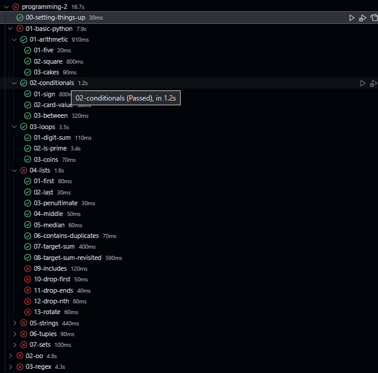

# PyTest For UCLL [Programming-2 exercise](https://github.com/UCLL-PR2/exercises)

Easy way to use PyTest on your programming-2 exercise solutions.

## Run Tests
Search for this icon  and click on it.\
Press on a run button .\
And wait for the results.

## View Errors
Press on any failed test .\
And It should open you stutend.py file and show a error.\
Like this one .

## TODO
- [X] Display failed test output
- [ ] Optimize
