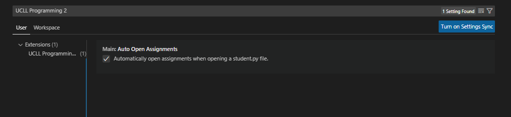

# PyTest For UCLL [Programming-2 exercises](https://github.com/UCLL-PR2/exercises)

Easy way to use PyTest on your programming-2 exercise solutions.

.

## Run Tests
Search for this icon  and click on it.\
Press on a run button .\
And wait for the results.

## View Errors
Press on any failed test .\
And It should open you stutend.py file and show a error.\
Like this one .

## Assignments
Opening a `student.py` file should automatically open the assignment.md file in the second window column in preview mode. You can change this behavior in your vscode settings under `UCLL Programming 2` section.\

## TODO
- [X] Display failed test output
- [X] Optimize
- [X] Auto open assigment went student.py file opens.
- [X] Add Configuration settings.
- [ ] Show error on tested files.
- [ ] Add OnDidDelete listener for TestProvider.
