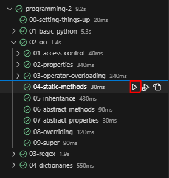

<h1>
    
    PyTest For UCLL
    <a href="https://github.com/UCLL-PR2/exercises">Programming-2 exercises</a>
</h1>

Extension which adds extra features that helps with `UCLL Prorgramming-2 exercises`.

.

<hr>

## `Assignments`
When you open a `student.py` file, the assignment.md file should open automatically in preview mode in a splitted window. If you want to change this behavior, you can modify your VS Code settings under the `UCLL Programming 2` section.\


<hr>

## `Run Tests`

### Search for this icon  in the sidebar and click on it to open the `Test Explorer`.
### Test a folder by pressing on a parent TestItem.

### Test a single item by pressing on a TestItem without children.

<hr>

## `Test Ouput Log`
### To open the Test output log, simply click on the square with the greater-than sign [>] in it.


### After you run the tests, you should see the test output showing in the `Test output log`.
### Each TestItem is split into purple sections with their path displayed in the header (first line).


### To minimize the information displayed in the `Test Output Log,` enable the `show Only Result Summary` setting under the `UCLL Programming 2` section.
### It's highly recommended to keep this setting disabled, as it can strip information from your error messages.
### It can sometimes be useful when there are many smaller error messages in your Test Output Log.


## `View Errors`
### To view the error message of a failed TestItem, simply deselect it and then click on it again.


### If everything works properly, the tests.py file should open and display the error that occurred.


### Expected vs Actual errors which display some errors more clearly.


### If you encounter an error message like the one shown below, it means that pytest is not installed on your system.
### Refer to the [installation guide](https://ucll-pr2.github.io/exercises/installation/python-packages.html) provided by your instructor to install any necessary extra packages.


<hr>

## `Feedback`
```ini
[UCLL Discord Server]: Jesse
[Discord Username]: MrFusiion#1125
```
### If you encounter any bugs, please open a `pull request` or message me via the information above.
### If you have idee's on how to improve the tool/extension send me a message via the information above.

<hr>

## `TODO`
- [X] Display failed test output
- [X] Optimize
- [X] Auto open assigment went student.py file opens.
- [X] Add Configuration settings.
- [X] Show error on tested files.
- [ ] Add OnDidDelete listener for TestProvider.
